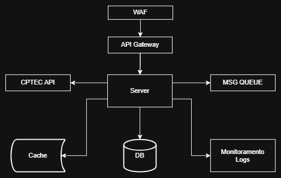

# 🌤️ Notificador de Previsão do Tempo

## 👀 Visão Geral

Este projeto foi desenvolvido com o objetivo de criar um sistema de notificações de previsão do tempo para usuários,
consumindo dados do CPTEC (Centro de Previsão de Tempo e Estudos Climáticos).

O sistema permite que usuários se cadastrem e assinem notificações sobre previsões do tempo para cidades específicas,
com agendamentos personalizados. Para cidades litorâneas, o sistema também fornece informações sobre ondas.

Perfeito! Com base no seu novo diagrama, aqui está um trecho de **README** para incluir no seu repositório, com uma
explicação clara da **arquitetura proposta** e **racional por trás das escolhas**. Está em português, como solicitado:

---

## 🧠 Arquitetura da Solução

Abaixo está o diagrama da arquitetura proposta para resolver o desafio:



---

### 🧭 Como cheguei nessa arquitetura

A arquitetura foi desenhada com foco em suprir os requisitos funcionais e não-funcionais. Cada componente é essencial
para garantir a escalabilidade, resiliência e facilidade de manutenção do sistema.

Abaixo está uma tabela com os principais componentes da arquitetura e o motivo da escolha:

| Componente               | Função                                                                                                                                                                                                                                                                                                                        |
|--------------------------|-------------------------------------------------------------------------------------------------------------------------------------------------------------------------------------------------------------------------------------------------------------------------------------------------------------------------------|
| **WAF**                  | Protege a aplicação contra ataques conhecidos (ex: SQLi, XSS, DDoS).                                                                                                                                                                                                                                                          |
| **API Gateway**          | Roteia chamadas para o serviço correto. Essencial, apesar de não implementado, seria essencial em produção ao escalar o serviço horizontalmente.                                                                                                                                                                              |
| **Frontend**             | Aplicação web que consome a API REST e WebSocket. Especialmente sobre WebSocket, pelo sistema ser algo que necessite de uma constante comunicação Servidor-->Cliente, e em vista da possibilidade de implementar uma comunicação também do Cliente-->Servidor, escolhi por utilizar essa tecnologia para simular o front-end. |
| **Server Backend**       | Monolito em Spring Boot que concentra regras de negócio, scheduler, consumo da API CPTEC e publica as notificações. Feito na arquitetura hexagonal para favorecer um menor acoplamento entre as partes e até mesmo o desmembramento do sistema em outro microsserviços.                                                       |
| **CPTEC API**            | API necessária para buscar previsões meteorológicas e de ondas.                                                                                                                                                                                                                                                               |
| **Message Queue**        | Kafka, usado para desacoplar o agendamento da entrega das notificações. A implementação dessa tecnologia, facilita a escalabilidade horizontal, e aumenta o throughput por ser uma ferramenta robusta de filas.                                                                                                               |
| **Database**             | PostgreSQL foi utilizado por existir um relacionamento claro do usuário com os outros componentes do sistema, fora isso, por ser um banco de dados ACID, aumenta a confiabilidade e integridade do sistema.                                                                                                                   |
| **Cache**                | Redis usado como cache de previsões. Essa ferramenta otimiza consultas repetidas que naturalmente são feitas a API's e até mesmo ao banco de dados, diminuindo a latência e favorecendo a escalabilidade.                                                                                                                     |
| **Monitoramento & Logs** | Para monitorar e concentrar os logs e métricas em um só lugar, é interessante a exposição de endpoints que facilitem o troubleshooting e monitoramento. Além disso, futuramente, planejo adicionar ao sistema ferramentas como ELK ou Grafana.                                                                                |

## Tecnologias Utilizadas

- **Backend**: Java 21 + Spring Boot 3.4
- **Banco de Dados**: PostgreSQL
- **Cache**: Redis
- **Mensageria**: Apache Kafka
- **Agendamento Distribuído**: Quartz Scheduler
- **Notificações Web**: WebSockets
- **Containerização**: Docker e Docker Compose

## Como Executar

### Pré-requisitos

- Java 21
- Maven
- Docker e Docker Compose

### Iniciar a Aplicação

1. Clone o repositório:

```bash
git clone https://github.com/felpschneider/notifier-forecast.git
cd notifier-forecast
```

2. Execute o Docker Compose:

```bash
docker-compose up -d
```

A aplicação estará disponível em `http://localhost:8080/api`

## Documentação

A documentação da API está disponível em `http://localhost:8080/api/docs`.

## Endpoints

Abaixo estão os principais endpoints da API, para acessar a documentação completa, consulte
o [Swagger](http://localhost:8080/api/swagger-ui/index.html).

### 1. Registro de Usuário

Endpoint: `POST /v1/auth/register`

Exemplo de requisição:

```json
{
  "name": "João Silva",
  "email": "joao@example.com",
  "phoneNumber": "+5511999999999",
  "password": "senha123"
}
```

### 2. Login

Endpoint: `POST /v1/auth/login`

Exemplo de requisição:

```json
{
  "email": "joao@example.com",
  "password": "senha123"
}
```

Resposta:

```json
{
   "token": "generated-token-here",
   "expiresAt": "timestamp"
}
```

### 3. Buscar Cidades

Endpoint: `GET /v1/cptec/cities/search?name=rio de janeiro`

Resposta:

```json
[
  {
    "idCptec": 241,
    "name": "Rio de Janeiro",
    "stateCode": "SP",
    "isCoastal": false
  }
]
```

### 4. Criar Subscrição

Endpoint: `POST /subscriptions`

Exemplo de requisição:

```json
{
   "city": {
      "idCptec": 241,
      "name": "Rio de Janeiro"
   },
   "cronExpression": "0 * * * * ?"
}
```

### 5. Conectar ao WebSocket

URL: `ws://localhost:8080/api/notifications`

Para autenticar, adicione o header na conexão:

```
Authorization: Bearer <jwt-token>
```
[Espaço para screenshot do Postman WebSocket]

## Estrutura do Projeto

A aplicação segue uma estrutura baseada em arquitetura hexagonal:

```
- adapter: Adaptadores de entrada e saída
    - in: adaptadores de entrada
        - web (controladores REST)
        - websocket (controladores WebSocket)
        - scheduler (jobs agendados)
    - out (adaptadores de saída)
        - persistence (repositórios JPA)
        - messaging (produtores Kafka)
        - integration (clientes HTTP para o CPTEC)
- application
    - port
        - in (portas de entrada - interfaces de serviço)
        - out (portas de saída - interfaces de repositório e outros)
    - service (implementações de serviço)
- config: Configurações gerais
- domain
    - model (modelos de domínio)
    - exception (exceções de negócio)
```

## Melhorias Futuras

- Implementação de novos canais de notificação (SMS, Push, Email)
- Dashboard para gerenciamento de assinaturas
- Expansão de métricas e monitoramento
- Interface de usuário para visualização de previsões
- Testes automatizados (unitários e de integração)